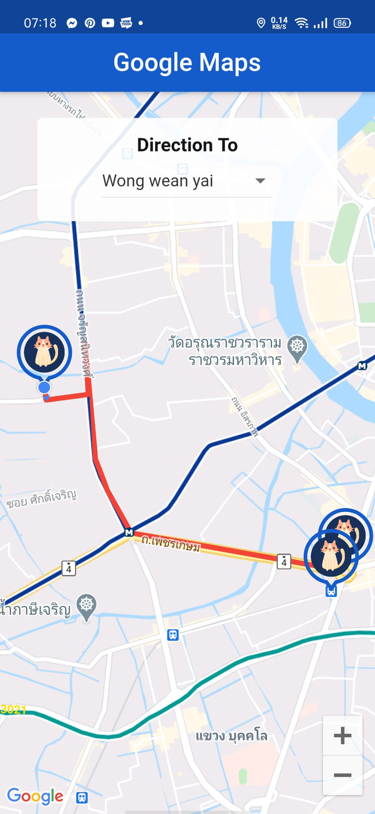

# Google Map Direction

A new Flutter project.

## Getting Started

1. Your have to get api key googlemaps fisrt -> https://cloud.google.com/maps-platform/
2. After get api key also you need to open Googlemap key for Android / IOS too.
3. Copy your key 

    - Copy your key and Press in lib/config 
    - Copy your key and Press in android/app/src/main/AndroidManifest.xml

This project for training student

Thank.

